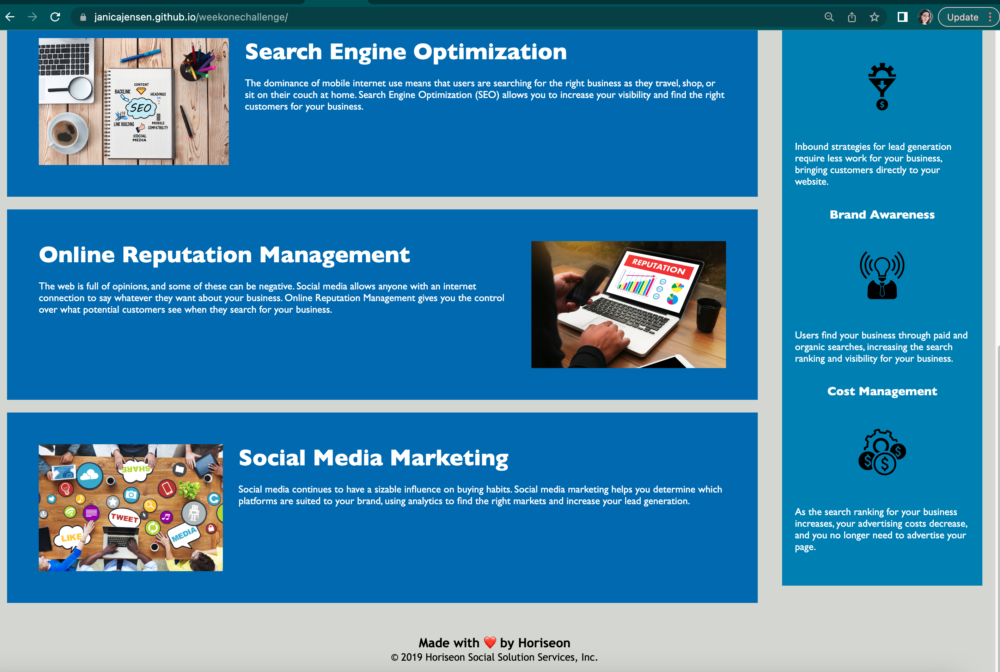

# weekonechallenge

# *Week One Challenge: Horiseon mock site*

*This is a mock site for a fictional SEO company that I was asked to refactor for efficiency and accessibility. This included adding alt photo descriptions, semantic HTML tags, and consolidating the CSS code.* 

## Setup 
The only setup required should be that one must click the URL to be taken to the site and that it should be opened within a full-width window, as the navigation bar in the header distorts upon minimization. 

The link for the deployed application is here: https://janicajensen.github.io/weekonechallenge/

## Usage

The site has a navigation bar on the top right that links to three different sections within the page. There is also aside bar to the right of the main content with further information regarding the site's company. If one were to want to read photo descriptions for accessibility reasons, they are coded in. 

## Team

* Janica Jackson -efficiency and accessibility updates
* EdX and U of U Bootcamp - provided the starter code.

## Errors and bugs

The site may be distorted if not viewing in a full window. 

There are no bugs that I have found or noticed, however, I do think the CSS code could possibly be consolidated a bit more, but I couldn't do it without breaking the site. The large background image was included through CSS and I was not able to include an "alt" attribute, so I used a WAI-ARIA attribute which is something I learned about in my coding game. I hope that is OK! The "internet" said that was an acceptable way to put a description on a photo that is linked through CSS which, is not something I know how to do and I didn't want to mess with it. 

## Images

